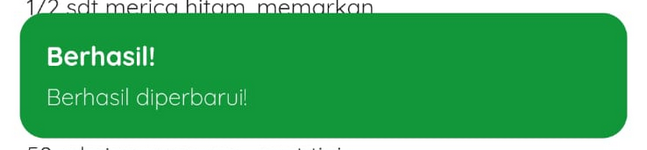
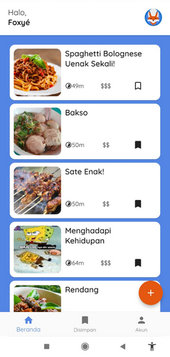
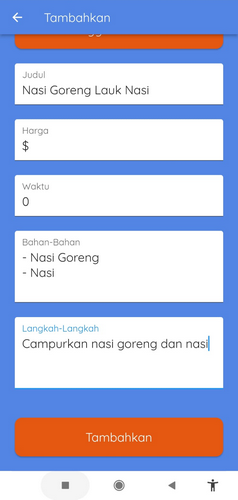

# UAS Pemrograman Mobile

**Nama**: Ferry Fathurrahman

**NIM**: 2009106051

**Kelas**: Informatika B 2020

## Navigasi

Digunakan dua jenis navigation, *named* dan secara langsung. Untuk yang *named*, *route*-nya diinisialisasikan dahulu di *main.dart*

```dart
...
routes: {
  "/landing": (context) => const LandingPage(),
  "/user_route": (context) => const UserRouteProcessing(),
  "/main": (context) => MainPage(),
  "/login": (context) => LoginPage(),
  "/register": (context) => RegistrationPage(),
  "/profile_edit": (context) => ProfileEditPage(),
},
...
```
Kemudian dipanggil dengan menggunakan fungsi navigasi. Di sini tidak digunakan `Navigator.pushReplacementNamed()`, melainkan `Get.offNamed()` dari *package* Get
```dart
...
TextButton(
  onPressed: () {
    Get.offNamed("/register");
  },
...
```
Untuk penggunaan navigasi secara langsung juga digunakan fungsi dari *package* Get, contohnya adalah sebagai berikut:
```dart
...
child: FloatingActionButton(
  backgroundColor: Palette.orange,
  onPressed: () {
    Get.to(() => recipeAddForm());
  },
  child: const Icon(Icons.add),
),
...
```

## ListView

ListView digunakan di hampir semua *page*, salah satunya ada di *home_page.dart* yang menggunakan `ListView.builder()`
```dart
...
ListView.builder(
  padding: const EdgeInsets.all(18),
  itemCount: _recipes.recipes.length,
  itemBuilder: (context, index) {
    final recipe = _recipes.recipes[index];
    return RecipeCard(
      image: recipe.image,
      title: recipe.title,
      price: recipe.price,
      time: recipe.time,
      ingredients: recipe.ingredients,
      steps: recipe.steps,
      bookmarked: recipe.bookmarked.value,
      docName: recipe.docName,
    );
  },
),
...
```

## Card\[View\]

Card digunakan untuk menampilkan informasi dasar dari resep. Contoh kodenya berada di *recipe_card.dart*:
```dart
...
return Card(
  shape: RoundedRectangleBorder(
    borderRadius: BorderRadius.circular(12),
  ),
  child: InkWell(
    onTap: () {
      Get.to(
        () => DetailPage(
          image: image,
          docName: docName,
        ),
      );
    },
    child: Container(
      height: 128,
      padding: const EdgeInsets.all(9),
      child: Row(
        children: [
        ...
```


## *Snackbar*

*Snackbar* yang digunakan ada 2, bawaan dari Flutter dan bawaan dari *package* Get. Untuk *snackbar* bawaan dari Flutter digunakan saat selesai mengedit profil. Kodenya ada pada *profile_edit.dart*:
```dart
...
ScaffoldMessenger.of(context).showSnackBar(
  const SnackBar(
    content: Text("Profil berhasil disimpan!"),
    backgroundColor: Palette.green,
    padding: EdgeInsets.all(12),
  ),
);
...
```
</br>
Sedangkan untuk *snackbar* dari *package* Get, digunakan saat selesai menambah dan memperbarui resep. Contohnya pada saat selesai menambah resep:
```dart
...
Get.snackbar(
  "Berhasil!",
  "Berhasil ditambahkan!",
  snackPosition: SnackPosition.BOTTOM,
  backgroundColor: Palette.green,
  colorText: Palette.white,
  margin: const EdgeInsets.all(12),
);
...
```


## API (GET)
API yang digunakan pada aplikasi ini adalah Firebase. Salah satu kode yang digunakan untuk melakukan *read* data kemudian memasukkannya ke dalam *list* adalah sebagai berikut:
```dart
...
await FirebaseFirestore.instance.collection("recipes").get().then(
      (value) => {
        for (var i in value.docs)
          {
            _recipes.add(
              Recipe(
                docName: i.id,
                title: i.get("title"),
                image: i.get("image"),
                time: i.get("time").toString(),
                price: i.get("price"),
                ingredients: i.get("ingredients"),
                steps: i.get("steps"),
                bookmarked: i.get("bookmarked"),
              ),
            ),
          },
      },
    );
...
```


## API (POST)
Contoh POST ada pada saat menambahkan resep seperti pada *recipe_form_page.dart*:
```dart
...
await FirebaseFirestore.instance.collection("recipes").add({
  "title": rfc.titleController.text,
  "price": rfc.priceController.text,
  "time": rfc.timeController.text,
  "steps": rfc.stepsController.text,
  "ingredients": rfc.ingredientsController.text,
  "image": "recipe_image/${rfc.fileName.value}",
  "bookmarked": false,
});
...
```



## API (UPDATE)
Proses *update* dapat dilakukan dengan masuk halaman detail, kemudian menekan tombol edit (pensil). Contoh kode *update* pada aplikasi ini adalah sebagai berikut:
```dart
...
await FirebaseFirestore.instance
    .collection("recipes")
    .doc(docName)
    .update({
  "title": rfc.titleController.text,
  "price": rfc.priceController.text,
  "time": rfc.timeController.text,
  "steps": rfc.stepsController.text,
  "ingredients": rfc.ingredientsController.text,
});
...
```


## API (DELETE)
Proses *delete* dapat dilakukan dengan masuk halaman detail, kemudian menekan tombol hapus (tong sampah). Kode *delete* pada aplikasi ini adalah sebagai berikut:
```dart
...
await FirebaseFirestore.instance
    .collection("recipes")
    .doc(docName)
    .delete();
...
```

## Pattern MVVM (Model View View-Model)
Penggunaan pattern MVVM pada aplikasi ini berada di data resep. Data yang diambil dari Firebase akan dijadikan objek (model), kemudian dimasukkan ke dalam *List* (view-model) untuk ditampilkan kepada pengguna (view).
Untuk kode model resep adalah sebagai berikut:
```dart
class Recipe {
  String image;
  String title;
  String price;
  String time;
  String ingredients;
  String steps;
  RxBool bookmarked = false.obs;
  String docName;

  Recipe({
    required this.image,
    required this.title,
    required this.price,
    required this.time,
    required this.ingredients,
    required this.steps,
    this.docName = "",
    bool bookmarked = false,
  }) {
    if (bookmarked) {
      this.bookmarked.value = true;
    }
  }
}
```

Untuk kode view-model resep adalah sebagai berikut:
```dart
class RecipesController extends GetxController {
  final RxList _recipes = [].obs;

  @override
  void onInit() {
    getData();
    super.onInit();
  }

  getData() async {
    _recipes.clear();
    await FirebaseFirestore.instance.collection("recipes").get().then(
          (value) => {
            for (var i in value.docs)
              {
                _recipes.add(
                  Recipe(
                    docName: i.id,
                    title: i.get("title"),
                    image: i.get("image"),
                    time: i.get("time").toString(),
                    price: i.get("price"),
                    ingredients: i.get("ingredients"),
                    steps: i.get("steps"),
                    bookmarked: i.get("bookmarked"),
                  ),
                ),
              },
          },
        );
  }

  List<Recipe> get recipes {
    return [..._recipes];
  }

  List get bookmarkedRecipes {
    return _recipes.where((item) => item.bookmarked.value).toList();
  }

  void removeRecipe(String docName) async {
    final int index =
        _recipes.indexWhere((recipe) => recipe.docName == docName);
    _recipes.removeAt(index);
  }
...
```
Salah satu kode untuk melakukan *view* resep ada pada *home_page.dart* untuk dijadikan Card, yaitu sebagai berikut:
```dart
...
Expanded(
  child: Obx(
    () => ListView.builder(
      padding: const EdgeInsets.all(18),
      itemCount: _recipes.recipes.length,
      itemBuilder: (context, index) {
        final recipe = _recipes.recipes[index];
        return RecipeCard(
          image: recipe.image,
          title: recipe.title,
          price: recipe.price,
          time: recipe.time,
          ingredients: recipe.ingredients,
          steps: recipe.steps,
          bookmarked: recipe.bookmarked.value,
          docName: recipe.docName,
        );
      },
    ),
  ),
),
...
```
